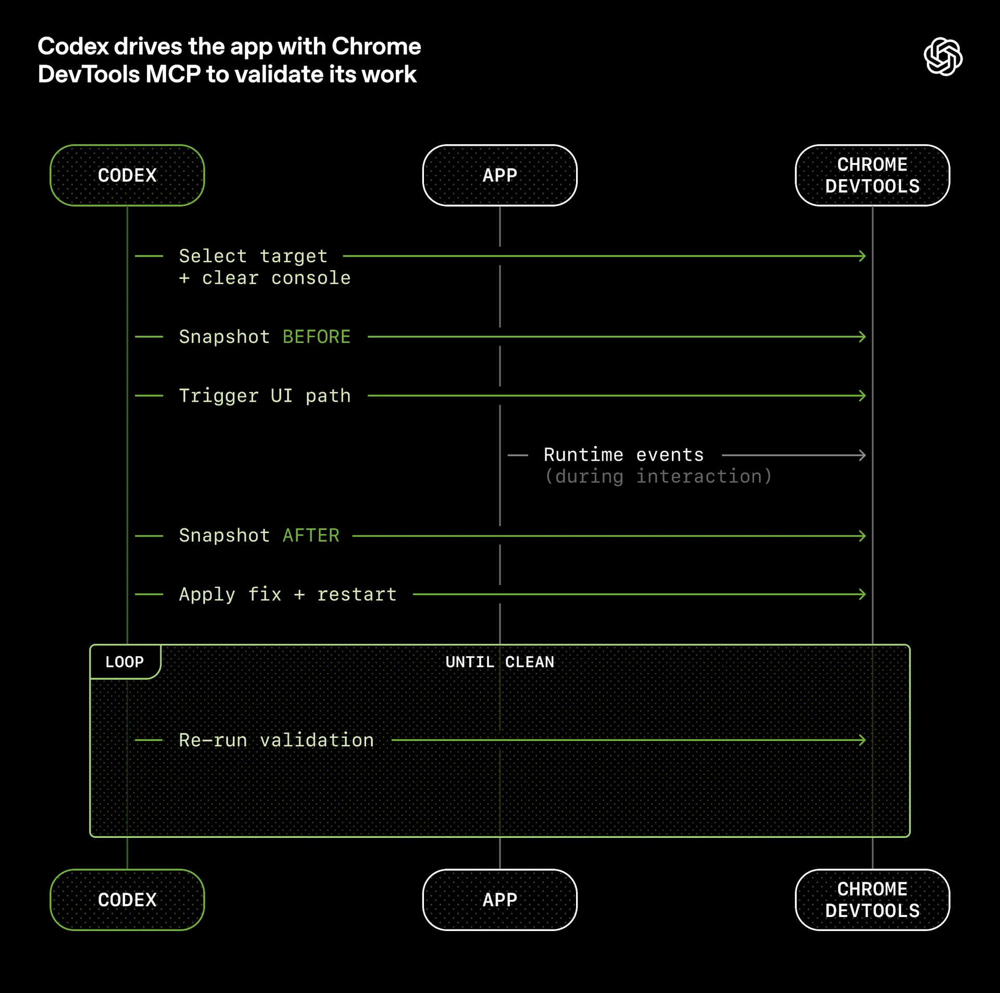
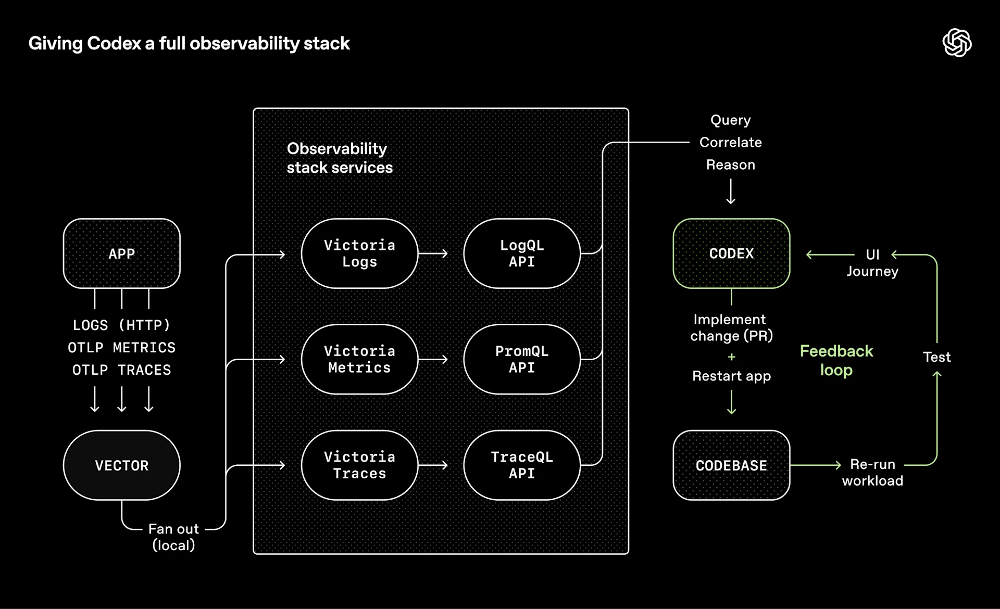
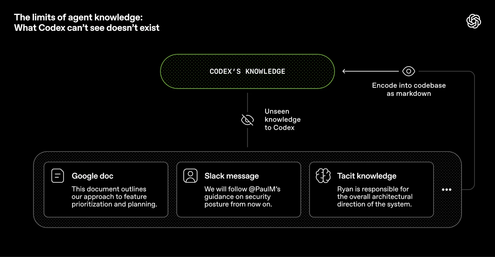
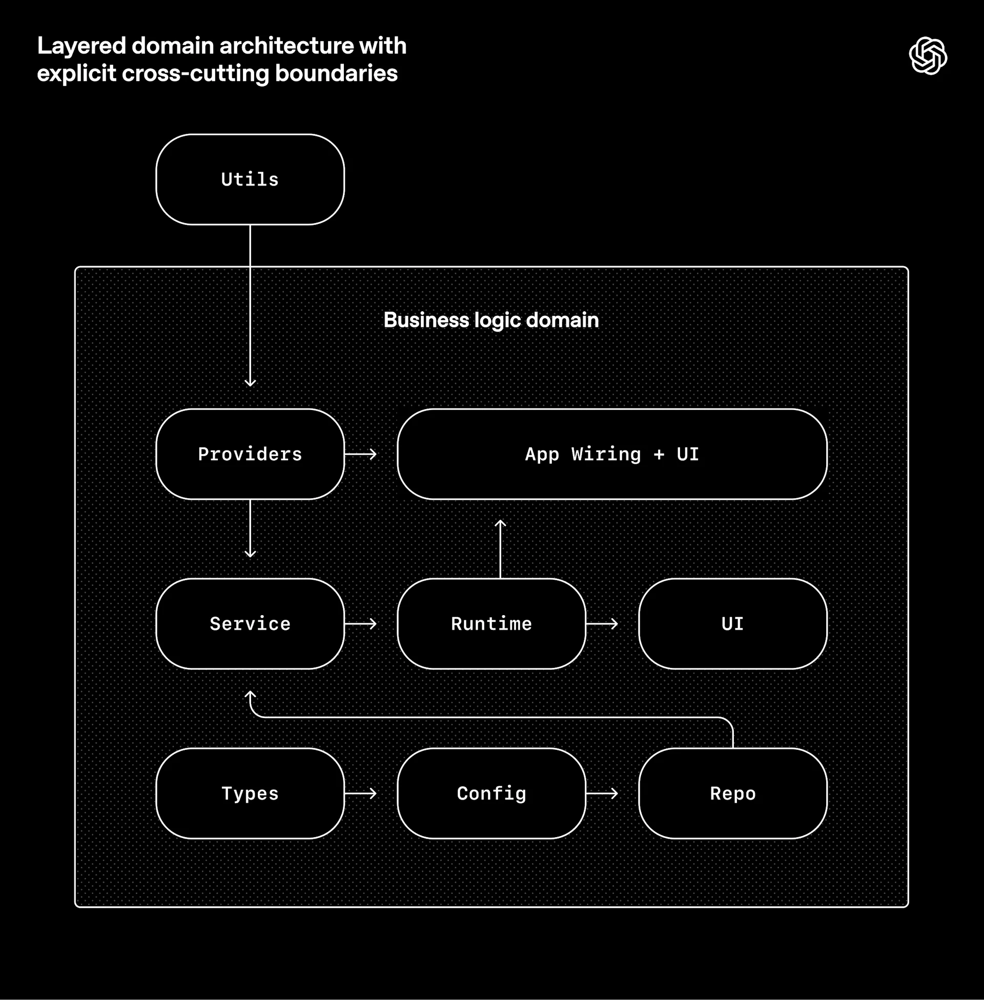

# 治理工程:在agent优先的世界中发挥Codex的作用

**作者:** Ryan Lopopolo, 技术团队成员
**日期:** 2026年2月11日

在过去的五个月里,我们团队一直在进行一项实验:构建并发布一款软件产品的内部beta版本,且手动编写的代码行数为0.

该产品拥有内部日常用户及外部alpha测试人员.它会发布,部署,出现故障并被修复.不同之处在于,每一行代码(应用逻辑,测试,CI配置,文档,可观测性及内部工具)都是由Codex编写的.我们估计,构建该产品所花费的时间大约是手工编写代码所需时间的十分之一.

人类负责引导.Agent负责执行.

我们刻意选择了这一约束条件,以便构建出必要的基础设施,从而将工程速度提高几个数量级.我们只有几周的时间来交付最终多达上百万行的代码.为了做到这一点,我们需要了解当软件工程团队的主要工作不再是编写代码,而是设计环境,详细说明意图及建立反馈循环以允许Codex agent进行可靠工作时,会发生什么变化.

本文讨论了我们通过与agent团队一起构建全新产品所学到的经验(哪些部分出现了故障,哪些部分产生了复利,以及如何最大化我们真正稀缺的资源:人类的时间和注意力).

## 我们从一个空的git仓库开始

对空仓库的首次提交发生在2025年8月下旬.

初始的脚手架(仓库结构,CI配置,格式化规则,包管理器设置及应用框架)是由Codex CLI使用GPT-5生成的,并受到一小部分现有模板的引导.甚至指导agent如何在仓库中工作的初始AGENTS.md文件本身也是由Codex编写的.

没有预先存在的人类编写的代码来锚定该系统.从一开始,仓库就是由agent塑造的.

五个月后,仓库包含了大约一百万行代码,涵盖应用逻辑,基础设施,工具,文档及内部开发者实用程序.在此期间,一个仅由三名负责驱动Codex的工程师组成的小团队开启并合并了大约1500个pull request.这意味着平均每位工程师每天的吞吐量为3.5个PR,令人惊讶的是,随着团队如今扩大到七名工程师,吞吐量也在增加.重要的是,这并非为了产出而产出:该产品已被内部数百名用户使用,包括日常内部高级用户.

在整个开发过程中,人类从未直接贡献过任何代码.这成为团队的核心理念:没有手动编写的代码.

## 重新定义工程师的角色

由于没有人类亲自动手编码,引入了一种不同类型的工程工作,这种工作侧重于系统,脚手架及杠杆作用.

早期的进展比我们预期的要慢,这不是因为Codex能力不足,而是因为环境的规范不够明确.Agent缺乏朝着高层次目标取得进展所需的工具,抽象概念及内部结构.我们工程团队的主要工作变成了让agent能够执行有用的工作.

在实践中,这意味着进行深度优先的工作:将较大的目标分解为较小的构建块(设计,代码,审查,测试等),提示agent构建这些模块,并利用它们来解锁更复杂的任务.当某个环节失败时,修复方法几乎永远不是"更努力地尝试".因为取得进展的唯一方法是让Codex完成工作,所以人类工程师总是介入任务并询问:"缺少了什么能力,我们如何使其对agent既清晰易懂又具有强制性?"

人类几乎完全通过提示与系统进行交互:工程师描述一项任务,运行agent,并允许其开启一个pull request.为了推动PR走向完成,我们指示Codex在本地审查其自身的更改,在本地和云端请求额外的特定agent审查,对人类和agent给出的任何反馈做出响应,并在循环中进行迭代,直到所有agent审查人员都感到满意(实际上这是一个Ralph Wiggum循环).Codex直接使用我们的标准开发工具(gh,本地脚本及仓库内置技能)来收集上下文,而无需人类复制并粘贴到CLI中.

人类可以审查pull request,但这并非强制要求.随着时间的推移,我们已将几乎所有的审查工作推向由agent与agent之间来处理.

## 提高应用程序的清晰度

随着代码吞吐量的增加,我们的瓶颈变成了人类QA的容量.由于固定的约束一直是人类的时间和注意力,我们一直在努力为agent添加更多功能,使应用程序UI,日志及应用指标等本身对Codex来说变得直接清晰易读.

例如,我们使应用程序能够在每个git worktree中启动,因此Codex可以针对每次更改启动并驱动一个实例.我们还将Chrome DevTools Protocol接入agent运行时,并创建了处理DOM快照,屏幕截图及导航的技能.这使得Codex能够直接重现错误,验证修复程序并对UI行为进行推理.



我们对可观测性工具采取了相同的做法.日志,指标及追踪信息通过本地可观测性技术栈暴露给Codex,该技术栈对于任何给定的worktree都是临时的.Codex在该应用程序的一个完全隔离的版本上工作(包括其日志和指标,一旦该任务完成,它们就会被销毁).Agents可以使用LogQL查询日志,使用PromQL查询指标.有了这些可用的上下文,"确保服务启动在800ms内完成"以及"在这些关键的四个用户旅程中,没有任何span超过两秒"等提示就变得易于处理了.



我们经常看到单次Codex运行在一项任务上工作长达六个小时以上(通常是在人类睡觉的时候).

## 我们将仓库知识作为记录系统

上下文管理是使agent在大型复杂任务中发挥效用的最大挑战之一.我们最早学到的经验之一很简单:给Codex一张地图,而不是一本1000页的说明书.

我们尝试过"一个巨大的AGENTS.md"方法.它以可预见的方式失败了:

* **上下文是一种稀缺资源.** 一个巨大的指令文件会挤占任务,代码及相关文档的空间,导致agent遗漏关键约束,进而开始针对错误的约束进行优化.
* **过多的指导会变成没有指导.** 当一切都很"重要"时,就没有什么是重要的了.Agent最终会在局部进行模式匹配,而不是有意识地进行导航.
* **它会立即腐烂.** 一个单体的手册会变成陈旧规则的坟墓.Agent无法分辨哪些仍然是真的,人类也停止了维护,该文件悄悄地变成了一个吸引人的滋扰物.
* **它很难被验证.** 单个的文本块不适合进行机械检查(覆盖率,新鲜度,所有权,交叉链接),因此漂移是不可避免的.

因此,我们不将AGENTS.md视为百科全书,而是将其视为目录.

仓库的知识库驻留在一个结构化的docs/目录中,该目录被视为记录系统.一个简短的AGENTS.md(大约100行)被注入到上下文中,主要用作地图,并附有指向其他地方更深层次事实来源的指针.

```text
1  AGENTS.md
2  ARCHITECTURE.md
3  docs/
4  ├── design-docs/
5  │ ├── index.md
6  │ ├── core-beliefs.md
7  │ └── ...
8  ├── exec-plans/
9  │ ├── active/
10 │ ├── completed/
11 │ └── tech-debt-tracker.md
12 ├── generated/
13 │ └── db-schema.md
14 ├── product-specs/
15 │ ├── index.md
16 │ ├── new-user-onboarding.md
17 │ └── ...
18 ├── references/
19 │ ├── design-system-reference-llms.txt
20 │ ├── nixpacks-llms.txt
21 │ ├── uv-llms.txt
22 │ └── ...
23 ├── DESIGN.md
24 ├── FRONTEND.md
25 ├── PLANS.md
26 ├── PRODUCT_SENSE.md
27 ├── QUALITY_SCORE.md
28 ├── RELIABILITY.md
29 └── SECURITY.md
```

*仓库内知识存储布局.*

设计文档被编目和建立索引,包括验证状态及一套定义agent优先操作原则的核心信念.架构文档提供了领域和包分层的顶级地图.质量文档对每个产品领域和架构层进行评分,随时间推移跟踪差距.

计划被视为一等工件.临时的轻量级计划用于小型变更,复杂的任务则被记录在执行计划中,其进度和决策日志会被检入仓库.活动计划,已完成计划及已知的技术债务都被版本化并放置在一起,允许agent在不依赖外部上下文的情况下进行操作.

这实现了渐进式披露:agent从一个小而稳定的入口点开始,被教导下一步该去哪里寻找,而不是一开始就被淹没.

我们机械地强制执行这一点.专用的linter和CI任务会验证知识库是否是最新的,交叉链接的以及结构是否正确.一个定期运行的"文档园艺"agent会扫描不再反映真实代码行为的陈旧且过时的文档,并开启修复pull request.

## Agent清晰度是目标

随着代码库的演进,Codex的设计决策框架也需要演进.

因为仓库完全由agent生成,它首先针对Codex的清晰度进行了优化.就像团队旨在提高新进工程师对代码的可导航性一样,我们人类工程师的目标是让agent能够直接从仓库本身推断出完整的业务领域.

从agent的角度来看,任何它在运行时无法在上下文中访问的内容实际上都不存在.存在于Google Docs,聊天线程及人们头脑中的知识对系统来说是不可访问的.仓库本地的,版本化的工件(例如代码,markdown,模式,可执行计划)是它唯一能看到的.



我们认识到,随着时间的推移,我们需要将越来越多的上下文推入仓库.那个让团队在架构模式上达成一致的Slack讨论呢?如果它对agent来说不可发现,那么它就如同对三个月后加入的新员工来说一样是不可读的.

为Codex提供更多上下文意味着组织并暴露正确的信息,以便agent可以对其进行推理,而不是用特别的指令淹没它.就像你会向新队友介绍产品原则,工程规范及团队文化(包括表情符号偏好)一样,为agent提供这些信息会带来更一致的输出.

这种框架澄清了许多权衡.我们倾向于那些可以在仓库中完全内部化并进行推理的依赖项及抽象.通常被称为"无聊"的技术往往更容易被agent建模,这是由于其可组合性,API稳定性及在训练集中的表现.在某些情况下,让agent重新实现功能的子集比处理公共库中不透明的上游行为成本更低.例如,我们没有引入通用的p-limit风格的包,而是实现了我们自己的map-with-concurrency辅助函数:它与我们的OpenTelemetry检测紧密集成,具有100%的测试覆盖率,并且其行为完全符合我们运行时的预期.

将更多系统提取为agent可以直接检查,验证及修改的形式,不仅可以增加对Codex的杠杆作用,对同样在代码库上工作的其他agent(例如Aardvark)也是如此.

## 强制执行架构和品味

单靠文档并不能使完全由agent生成的代码库保持连贯.通过强制执行不变量,而不是微观管理实现细节,我们让agent能够快速交付而不会破坏基础.例如,我们要求Codex在边界处解析数据形状,但并不规定它是如何发生的(模型似乎喜欢Zod,但我们并没有指定那个特定的库).

Agent在具有严格边界及可预测结构的环境中最有效,因此我们围绕着严格的架构模型构建了应用程序.每个业务领域都被划分为一组固定的层级,具有严格验证的依赖方向及一组有限的允许边缘.这些约束通过自定义linter(当然是Codex生成的)及结构测试来机械地强制执行.

下图展示了这一规则:在每个业务领域(例如应用设置)内,代码只能通过一组固定的层级(Types → Config → Repo → Service → Runtime → UI)进行"向前"依赖.交叉关注点(auth, connectors, telemetry, feature flags)通过一个单一的显式接口进入:Providers.禁止一切其他操作并进行机械化强制执行.



这是那种你通常会推迟到拥有数百名工程师时才会采用的架构.对于编码agent来说,这是一个早期的先决条件:约束条件正是允许在不发生衰退且架构不发生漂移的情况下实现速度的原因.

在实践中,我们通过自定义linter和结构测试,外加一小部分"品味不变量"来强制执行这些规则.例如,我们使用自定义lint静态强制执行结构化日志记录,模式和类型的命名约定,文件大小限制及特定平台的可靠性要求.由于lint是自定义的,因此我们编写错误消息以将补救说明注入到agent上下文中.

在以人类优先的工作流中,这些规则可能会让人感到迂腐及受约束.在有agent参与的情况下,它们成了乘数:一旦被编码,它们就会同时应用于所有地方.

同时,我们明确指出了约束在何处起作用,在何处不起作用.这类似于领导一个大型工程平台组织:在中央强制执行边界,在局部允许自治.你深切关注边界,正确性及可重复性.在这些边界内,你允许团队(以及agent)在表达解决方案的方式上有很大的自由度.

生成的代码并不总是符合人类的风格偏好,这是可以接受的.只要输出正确,可维护并且对未来的agent运行清晰易读,它就达到了标准.

人类的品味不断反馈到系统中.审查评论,重构pull request及面向用户的bug都被捕获为文档更新及被直接编码到工具中.当文档不足时,我们会将规则提升到代码中.

## 吞吐量改变了合并理念

随着Codex吞吐量的增加,许多传统的工程规范变得适得其反.

仓库以最小的阻塞合并门槛运行.Pull request的生命周期很短.测试的偶然失败通常通过后续运行来解决,而不是无限期地阻碍进度.在一个agent吞吐量远远超过人类注意力的系统中,修正的成本很低,而等待的成本很高.

这在低吞吐量环境中是不负责任的.然而在这里,这通常是正确的权衡.

## "由Agent生成"的真正含义

当我们说代码库是由Codex agent生成时,我们指的是代码库中的所有内容.

Agent生成:

* 产品代码和测试
* CI配置和发布工具
* 内部开发者工具
* 文档和设计历史
* 评估测试工具
* 审查评论和回复
* 管理仓库本身的脚本
* 生产仪表板定义文件

人类始终留在循环中,但在与过去不同的抽象层级上工作.我们确定工作的优先级,将用户反馈转化为验收标准并验证结果.当agent遇到困难时,我们将其视为一种信号:识别缺少了什么(工具,护栏,文档)并将其反馈回仓库,始终让Codex自己编写修复程序.

Agent直接使用我们的标准开发工具.它们拉取审查反馈,进行内联响应,推送更新,并且经常压缩合并它们自己的pull request.

## 不断提高的自主性水平

随着越来越多的开发循环(测试,验证,审查,反馈处理及恢复)直接编码到系统中,仓库最近跨越了一个有意义的阈值,此时Codex可以端到端地驱动一项新功能.

只要给出一个提示,agent现在就可以:

* 验证代码库的当前状态
* 重现报告的错误
* 录制展示失败的视频
* 实施修复
* 通过驱动应用程序验证修复
* 录制展示解决方案的第二段视频
* 开启一个pull request
* 响应agent和人类的反馈
* 检测并补救构建失败
* 仅在需要判断时升级给人类
* 合并更改

这种行为严重依赖于该仓库特定的结构和工具,在没有进行类似投资的情况下,不应假定它可以被泛化(至少目前还不行).

## 熵与垃圾回收

完全的agent自主性也引入了新的问题.Codex会复制仓库中已存在的模式(即使是不均匀及次优的模式).随着时间的推移,这不可避免地会导致漂移.

最初,人类手动解决这个问题.我们的团队曾经每个星期五(一周的20%)都在清理"AI产生的废料".不出所料,这无法扩展.

相反,我们开始将我们所谓的"黄金原则"直接编码到仓库中,并建立了一个定期的清理流程.这些原则是带有观点的,机械性的规则,可为未来的agent运行保持代码库的清晰和一致.例如:(1)我们偏好共享的实用程序包,而不是手工编写的辅助程序,以保持不变量的集中;(2)我们不以"YOLO"风格探测数据——我们验证边界及依赖于类型化的SDK,因此agent不会意外地建立在猜测的形状上.以固定的节奏,我们有一组后台Codex任务会扫描偏差,更新质量评分,并开启针对性的重构pull request.其中的大多数都可以在一分钟内被审查并自动合并.

这起到了类似垃圾回收的作用.技术债务就像高息贷款:以小增量持续偿还它,几乎总是比让它复利并在痛苦的爆发中解决它更好.人类品味被捕获一次,然后持续在每一行代码上强制执行.这也让我们能够在每天的基础上捕捉并解决不良模式,而不是让它们在代码库中蔓延数天甚至数周.

## 我们仍在学习什么

到目前为止,这一策略在OpenAI的内部发布和采用过程中运作良好.为真实用户构建真实产品有助于将我们的投资锚定在现实中,并引导我们走向长期可维护性.

我们尚不知道在一个完全由agent生成的系统中,架构连贯性在未来几年将如何演变.我们仍在学习人类判断在何处增加最大的杠杆作用,以及如何编码这些判断以使其产生复利.我们也不知道随着模型随着时间的推移变得越来越强大,这个系统将如何演变.

已经明确的是:构建软件仍然需要纪律,但这种纪律更多地体现在脚手架上,而不是代码本身中.保持代码库连贯的工具,抽象及反馈循环正变得越来越重要.

我们目前最困难的挑战集中在设计环境,反馈循环及控制系统上,这些系统帮助agent实现我们的目标:大规模地构建并维护复杂且可靠的软件.

随着像Codex这样的agent承担了软件生命周期的更大部分,这些问题将变得更加重要.我们希望分享一些早期的经验教训能够帮助您思考应在何处投入精力,以便您能够专注于构建事物.
